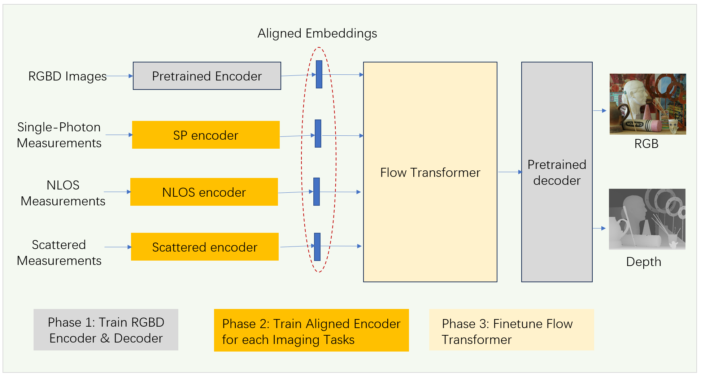
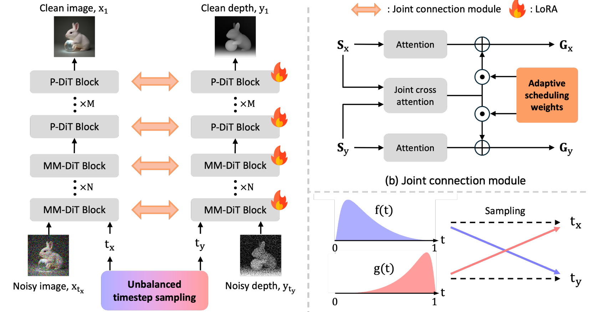

# Unifying Computational Imaging via a Multi-Modal Foundation Model

## Acknowledgements

This work builds upon the excellent prior contributions of the following projects:

- **[Flux](https://huggingface.co/black-forest-labs/FLUX.1-dev)** by Black Forest Labs — we use their pretrained diffusion model and autoencoder.
- **[JointDiT](https://byungki-k.github.io/JointDiT/)** by Microsoft Research Asia — we adopt and extend their RGBD autoencoder infrastructure.

## Environment setup

This code was developed on Ubuntu 24.04 with Python 3.10.18, CUDA 12.1 and PyTorch 2.4.0, using 8 NVIDIA H200 (160GB) GPUs.

### 1. Create and activate conda environment

```bash
conda create -n GOM python=3.10 -y
conda activate GOM
```

### 2. Install dependencies

```bash
pip install torch==2.4.0 torchvision==0.19.0 torchaudio==2.4.0 \
    xformers --index-url https://download.pytorch.org/whl/cu121
pip install -r requirements.txt
```

### 3. Download Flux model & autoencoder

> You must be logged in via `huggingface-cli login`

```bash
# Flux model
huggingface-cli download black-forest-labs/FLUX.1-dev \
    flux1-dev.safetensors --local-dir ./models/flux

# Autoencoder
huggingface-cli download black-forest-labs/FLUX.1-dev \
    ae.safetensors --local-dir ./models/flux
```

### 4. Download text encoders

```bash
huggingface-cli download comfyanonymous/flux_text_encoders \
    clip_l.safetensors t5xxl_fp16.safetensors \
    --local-dir ./models/flux
```

## 🚀 Training

Our overall training pipeline consists of three main stages. First, we train a high-quality RGBD AutoEncoder. Next, we train task-specific encoders for different imaging modalities to align their data with the RGBD features. Finally, we freeze both the encoders and the decoder to train the flow matching model.



### 🔹 Step 1: Dataset Preparation

Currently, we support 8 common imaging tasks, categorized into 3D and 2D imaging:

* **3D Imaging Tasks:** Single-photon imaging, Non-Line-of-Sight (NLOS) imaging, imaging through scattering media, and radar Synthetic Aperture Radar (SAR) imaging.
* **2D Imaging Tasks:** Holographic phase imaging, single-pixel imaging, optical synthetic aperture imaging, and polarized imaging through scattering media.

**Data Generation:**

* For **3D imaging tasks**, we utilize our custom [3D Imaging Engine](https://github.com/yeruilin/ImagingEngine), which allows us to simultaneously generate 3D voxel ground truth, RGBD ground truth, and 3D measurement results.
* For **2D imaging tasks**, we use the COCO dataset, randomly sampling physical parameters to directly generate paired data of 2D measurements and 2D ground truths.

### 🔹 Step 2: Training the RGBD AutoEncoder (Phase 1)

We fine-tuned the RGBD AutoEncoder based on the training principles of JointDiT. Specifically, we jointly model the RGB and depth distributions to ensure the latent space accurately captures both high-frequency textural details and precise geometric structures. We utilize a combination of reconstruction and perceptual losses to regularize the latent space, providing a highly robust and aligned foundational representation for downstream cross-modal tasks.



### 🔹 Step 3: Training Aligned Encoders (Phase 2)

Aligning encoders across drastically different imaging tasks is challenging. To facilitate this, we embed specific physical layers into the encoders, which significantly accelerates convergence and improves alignment quality. For example, we incorporate Wiener filtering for single-photon imaging and the Light-Cone Transform (LCT) for NLOS imaging.

During the training of these task-specific encoders, we optimize using two primary losses:

1. An **MSE Loss** between the RGB/depth latents output by the task encoder and the target latents from the pre-trained RGBD encoder.
2. A **Reconstruction Loss** applied after passing the latents through the decoder.

*(Note: For tasks like single-photon imaging, we also incorporate a Total Variation (TV) loss to effectively denoise the results.)*

### 🔹 Step 4: Training the Flow Transformer (Phase 3)

Training the flow matching model requires significant GPU memory. Since we jointly train across multiple tasks, we pre-process the training data to extract and save the latents from the frozen encoders. This avoids passing raw 3D data through the encoders at runtime during training—a process that would otherwise be extremely slow and bottleneck the batch size to just 1 or 2.

Below is an example training script:

```bash
accelerate launch --config_file model_config.yaml --main_process_port 12342 --mixed_precision bf16 \
--num_cpu_threads_per_process 8 train.py \
--image_folder "your_image_folder" \
--output_dir experiments \
--exp_name test_training \
--output_resolution 1024 1024 \
--depth_transform none \
--save_model_as safetensors --sdpa \
--persistent_data_loader_workers --max_data_loader_n_workers 16 --seed 42 --gradient_checkpointing --mixed_precision bf16 \
--save_precision bf16 \
--output_name joint \
--learning_rate 1e-5 --max_train_epochs 8  --sdpa --highvram --save_every_n_epochs 1 --optimizer_type adafactor \
--optimizer_args "relative_step=False" "scale_parameter=False" "warmup_init=False" --lr_scheduler constant_with_warmup \
--max_grad_norm 0.0 --timestep_sampling shift --discrete_flow_shift 3.1582 --model_prediction_type raw --guidance_scale 1.0 \
--fused_backward_pass  --blocks_to_swap 8 --full_bf16 \
--sample_every_n_steps 5000 \
--save_every_n_steps 25000 \
--train_batch_size 4 \
--sample_at_first
```

## 🚀 Inference

Below is an example of inference for a single imaging task, using NLOS imaging as the example:

```bash
accelerate launch --config_file model_config.yaml --mixed_precision bf16 inference.py \
  --mode NLOS \
  --data_path data/NLOS/fk-teaser180.mat \
  --guidance_scale 3.5 \
  --blocks_to_swap 8 \
  --mixed_precision bf16 \
  --save_precision bf16 \
  --full_bf16 
```
